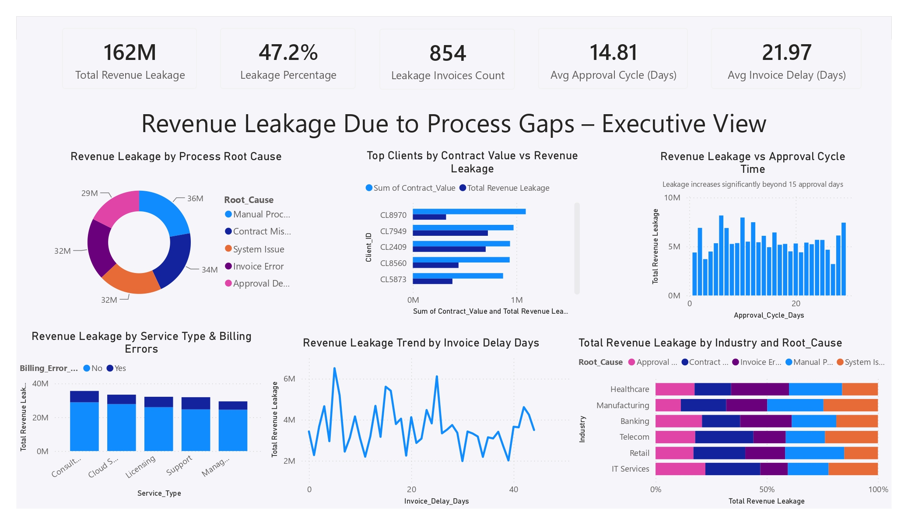

# 💰 Revenue Leakage Due to Process Gaps – Executive View

A comprehensive **Power BI Dashboard** designed to identify revenue leakage caused by operational process gaps. This dashboard provides executive-level insights into approval delays, billing errors, contract issues, invoice processing, and industry-specific revenue losses, enabling organizations to improve financial controls and operational efficiency.

---

## 📷 Dashboard Preview

---

# 📌 Project Overview

The **Revenue Leakage Due to Process Gaps – Executive View** dashboard helps organizations monitor financial losses resulting from inefficient business processes. It highlights key operational bottlenecks, identifies major revenue leakage drivers, and enables executives to make informed decisions to reduce financial losses.

The dashboard is designed for:

- Finance Managers
- CFOs
- Business Analysts
- Revenue Operations Teams
- Internal Audit Teams
- Process Improvement Managers

---

# 🎯 Business Problem

Revenue leakage often occurs due to inefficient workflows, delayed approvals, billing inaccuracies, contract management issues, and invoice processing delays. These hidden losses can significantly impact an organization's profitability.

This dashboard answers critical business questions such as:

- What are the major causes of revenue leakage?
- Which industries experience the highest financial losses?
- Does approval cycle time influence revenue leakage?
- Which clients contribute the highest revenue leakage?
- How do billing errors affect revenue performance?
- Which service types are most vulnerable to process gaps?

---

# 📂 Dataset

The dataset includes information such as:

- Client ID
- Industry
- Service Type
- Contract Value
- Revenue Leakage
- Root Cause
- Approval Cycle Days
- Invoice Delay Days
- Billing Error Status
- Invoice Details

---

# 📈 Dashboard KPIs

| KPI | Value |
|------|--------|
| Total Revenue Leakage | 162M |
| Revenue Leakage Percentage | 47.2% |
| Leakage Invoices | 854 |
| Average Approval Cycle | 14.81 Days |
| Average Invoice Delay | 21.97 Days |

---

# 📊 Dashboard Features

## 1. Revenue Leakage by Process Root Cause

Analyzes financial losses caused by:

- Manual Processing
- Contract Mismatch
- System Issues
- Invoice Errors
- Approval Delays

**Purpose**

- Identify the largest contributors to revenue leakage.

---

## 2. Top Clients by Contract Value vs Revenue Leakage

Compares:

- Contract Value
- Revenue Leakage

for major clients.

**Purpose**

- Identify high-value clients experiencing significant revenue leakage.

---

## 3. Revenue Leakage vs Approval Cycle Time

Visualizes the relationship between:

- Approval Cycle Days
- Revenue Leakage

**Purpose**

- Evaluate how approval delays influence financial losses.

---

## 4. Revenue Leakage by Service Type & Billing Errors

Compares revenue leakage across service categories while distinguishing between:

- Billing Error Present
- No Billing Error

Service types include:

- Consulting
- Cloud Services
- Licensing
- Support
- Managed Services

**Purpose**

- Assess the financial impact of billing inaccuracies.

---

## 5. Revenue Leakage Trend by Invoice Delay Days

Line chart illustrating revenue leakage against invoice processing delays.

**Purpose**

- Understand how invoice delays contribute to financial loss.

---

## 6. Industry-wise Revenue Leakage by Root Cause

Stacked bar chart comparing revenue leakage across industries such as:

- IT Services
- Retail
- Telecom
- Banking
- Manufacturing
- Healthcare

**Purpose**

- Identify industries most affected by specific process failures.

---

# 🛠 Tools Used

- Microsoft Power BI
- Power Query
- DAX
- Microsoft Excel
- Data Modeling

---

# 📌 Key Insights

- Total revenue leakage across the analyzed dataset amounts to **162M**.
- Nearly **47.2%** of potential revenue is affected by operational process gaps.
- Manual processing and contract mismatches are among the leading causes of revenue leakage.
- Revenue leakage increases noticeably when approval cycles extend beyond **15 days**.
- Invoice processing delays are strongly associated with higher financial losses.
- Healthcare, Banking, and IT Services show significant revenue leakage across multiple root causes.
- Billing errors contribute substantially to revenue loss across service offerings.

---

# 💼 Business Value

This dashboard enables organizations to:

- Reduce operational revenue leakage.
- Improve approval workflows.
- Enhance invoice processing efficiency.
- Detect billing and contract issues early.
- Strengthen financial governance.
- Optimize revenue operations through data-driven decision-making.

---

# 🚀 Future Enhancements

- AI-based revenue leakage prediction
- Real-time ERP integration
- Department-wise leakage analysis
- Root cause drill-through reporting
- Automated anomaly detection
- Interactive financial risk alerts

---

# 📚 Skills Demonstrated

- Data Cleaning
- Data Modeling
- Power Query
- DAX Measures
- KPI Development
- Financial Analytics
- Business Intelligence
- Executive Dashboard Design
- Process Performance Analysis
- Data Visualization

---

# 👨‍💻 Author

**Yashwanth Katuru**

Aspiring Data Analyst | Power BI Developer

### Technical Skills

- Power BI
- SQL
- Excel
- Python
- Financial Analytics
- Dashboard Development
- Data Visualization
